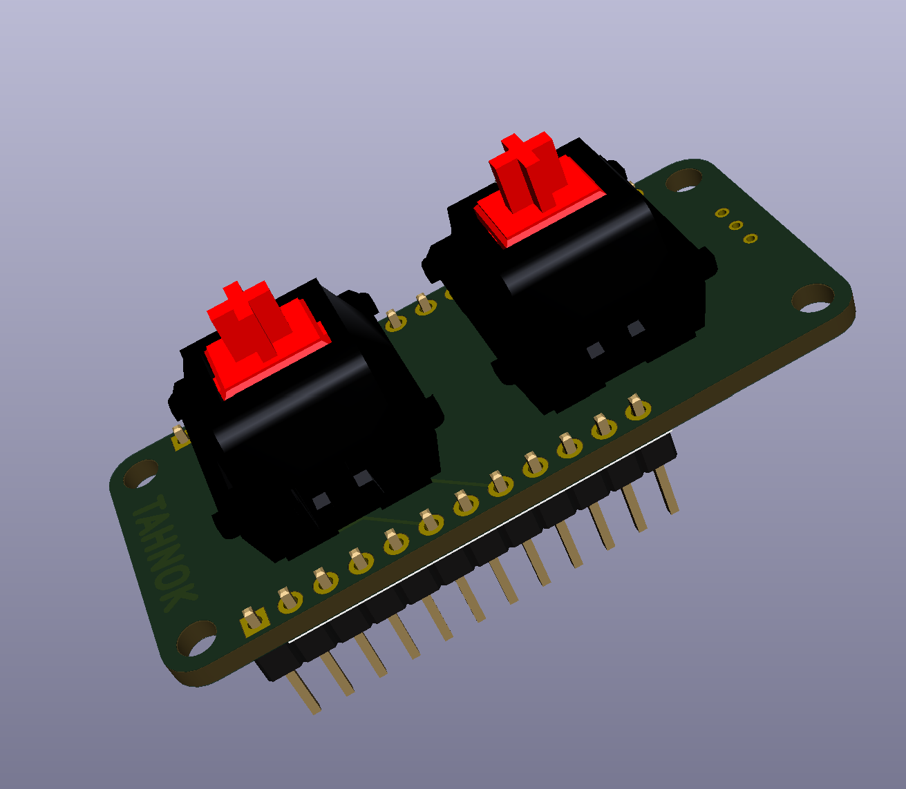

# 2FER

```
________________________________________
\_____  \_   _____/\_   _____/\______   \
 /  ____/|    __)   |    __)_  |       _/
/       \|     \    |        \ |    |   \
\_______ \___  /   /_______  / |____|_  /
        \/   \/            \/         \/
```

A 2 key keyboard for cherry mx switches in the featherwing form factor


Runs (hopefully) QMK firmware, over at this branch: https://github.com/tahnok/qmk_firmware/tree/2fer

3D models from https://github.com/ktec-hq/kicad-library

